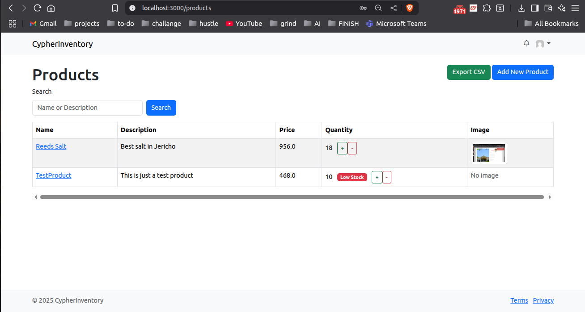
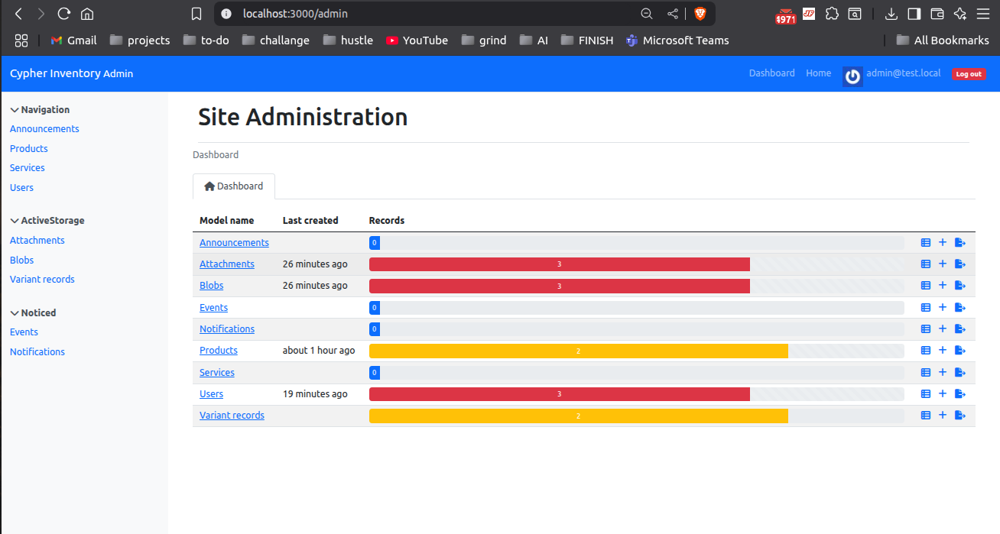

# 🧾 Cypher Inventory System

A powerful inventory management system for small businesses and retail shops — built with **Ruby on Rails**, **Hotwire**, and modern Rails tools.  
This system supports stock tracking, image uploads, low-stock alerts, admin-only control, and clean CSV exports.

---

## 🚀 Features

- ✅ **Product Management** — full CRUD interface
- 📦 **Stock Tracking** — real-time quantity updates via Hotwire
- ⚠️ **Low Stock Notifications** — alerts when items hit critical levels
- 🔐 **Admin-only Features** — secure access control
- 🖼️ **Image Upload** — with Active Storage and thumbnails
- 🔍 **Search & Filter** — using Ransack
- 📤 **CSV Export** — export full product list
- 🛡️ **Admin Dashboard** — via RailsAdmin
- 🎨 **Bootstrap 5 UI** — responsive and clean interface

---

## 📸 Screenshots

### 🧑 User Product Dashboard


### 👑 Admin Dashboard



---

## 🛠️ Tech Stack

- **Ruby on Rails** 7.1
- **PostgreSQL**
- **Hotwire (Turbo + Stimulus)**
- **Active Storage**
- **Ransack**
- **Devise**
- **RailsAdmin**
- **Bootstrap 5**

---

## ✅ Getting Started

### 1. Clone the Repo

```bash
git clone https://github.com/markiplagat/cypher_inventory.git

cd cypher_inventory
```

### 2. Clone the Repo

``` 
bundle install
yarn install
```
### 3. Set Up the Database

```
rails db:setup
```

Seeds two users:

👑 admin@test.local -> Password: cypher12

🙋 user@test.local -> Password: cypher12

### 4. Start the Server
```
rails s
```

## 🔐 Admin Dashboard
Access the full dashboard at:
http://localhost:3000/admin
Only accessible by users with admin: true.

## 📤 CSV Export
From the Products page (/products), click "Export CSV" to download a .csv of the full inventory.

## 🖼️ Image Upload
When creating or editing products, upload an image which will be displayed in the product table.
Images are stored via Active Storage, and thumbnails are generated using ImageMagick.

## ✉️ Email Notifications
Low stock alerts (when quantity hits 10) send emails using StockMailer.


# 🙋 Author
- Mark Rutto
- Ruby on Rails Developer • React.js Enthusiast
- GitHub: @markiplagat
